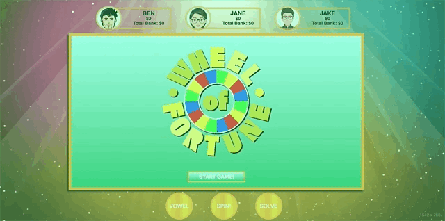
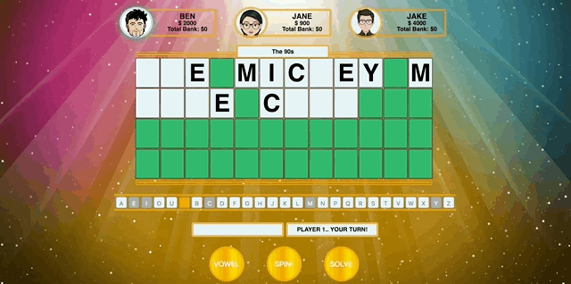

# Wheel of !Fortune - Turing Mod 2 FE Project
A site for users to play Wheel of Fortune with their friends; Solve puzzles, and win money in hopes to make it to the Bonus Round where they have a chance to win the ultimate grand prize.

### Set Up - Front-end
Clone this repo
Run `npm install` in your terminal

### Test Driven Development
Wheel of !Fortune uses Mocha and Chai for testing

Run with `npm test` from the associated root directory

### Background / About
Background / About:
For this project we leveraged object-oriented programming (OOP) principles to build the game, Wheel of Fortune from scratch. The project combines implementation of array prototype method understanding that iterates or mutates a specific set of data with the principles of test-driven-development to deliver clean, easy-to-use code. 

The game consists of 5 rounds, including 1 bonus round. It allows three users to select letters to solve a puzzle with only a category name as a clue. Each player has one move per turn and the player that solves the generated round puzzle wins that round. Only the round winning player's score will be added to their total bank score. The player with the highest total bank score at the end of 4 rounds will move onto the bonus round. The lucky bonus round player has a chance to win 1 of 10 amazing prizes by picking 3 consonants and 1 vowel of a generated bonus puzzle and attempting to solve. If the bonus round player does not solve the bonus puzzle, they will still win the money in their total bank.

### Primary JavaScript Technologies Used
- Javascript/JQuery

### Enhancements
Additional enhancements will include:
1. User Name Inputs for player 1 - player 3 
2. Method to randomize player priority 
3. Wheel animation/slider 
4. Sophisticated and subtle CSS styling, transitions and animation
1. Refactor long if/else statements

### Screenshots

### Original Assignment
Mod 2 Project from Turing School of Software & Design
http://frontend.turing.io/projects/wheel-of-fortune.html

### Contributors
Cole Vanacore : (https://github.com/colev1)

Libby Yeh : (https://github.com/libbyeh)
